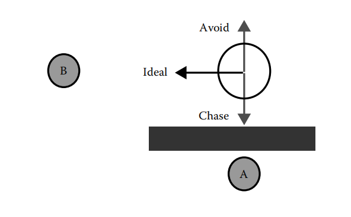
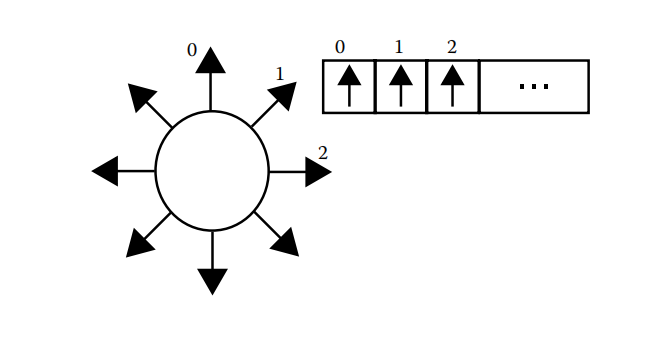
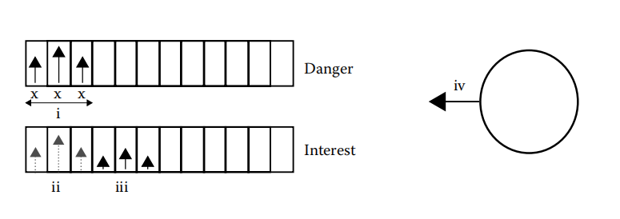
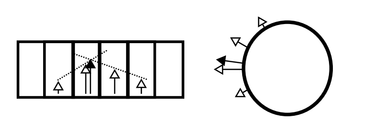

# 转向行为 AkiSteer 简介 Intro

AkiSteer是一款由[爱姬kurisu](https://space.bilibili.com/20472331)拓展，衍生自SunnyValleyStudio的[Unity-2D-Context-steering-AI](https://github.com/SunnyValleyStudio/Unity-2D-Context-steering-AI)的一款转向行为插件。

## 插件依赖

* [AkiBT](https://github.com/AkiKurisu/AkiBT/releases)用于提供AI的移动行为,如果你有自己的AI运行模式和架构可以不导入Extend.AI
* [PathCreator](https://github.com/SebLague/Path-Creator)用于提供AI按特定轨迹移动,原作者[SebLague](https://github.com/SebLague)
* [Odin](https://assetstore.unity.com/packages/p/odin-inspector-and-serializer-89041)用于美化Inspector界面和方便调试，如果你没有该插件可以选择将报错的Attributes全部去除，并不影响使用

# 使用目的 Purpose

1.解决多个游戏AI同路径移动时的拥挤问题

2.使游戏AI的移动更加丰富有趣,例如围绕着目标移动或按照弧线移动

# 工作原理How It Works



1.图片中描述了一个AI的移动需求，它需要追逐A对象，但和A之间有一堵墙，因此最佳的方式是往左移动直到与A之间没有墙遮挡。



2.转向行为的运行方式是将某一个方向的向量拆解为多个方向向量，如图为八个方向(这对于大部分2D游戏已经完全足够)。



3.对于不同的行为(即AI的不同目标例如追敌和躲避敌人),我们可以将该目标的方向同样拆解为多个方向的向量。并且根据目的分为Danger(躲避讨厌的对象)和Interest(追击感兴趣的对象)两种，前者将方向设置为负值，后者为正值。



4.最后我们将每个方向上的方向进行计算即简单的加法，我们就可以合成出一个最理想的移动方向了。

引用自[Context Steering Behavior-Driven Steering at the Macro Scale Andrew Fray](http://www.gameaipro.com/GameAIPro2/GameAIPro2_Chapter18_Context_Steering_Behavior-Driven_Steering_at_the_Macro_Scale.pdf)

## 优势Advantage

如果你仔细阅读了上述的原理，你可能会发现转向行为提供的不是移动的模式，而是一种移动的依据，我们得到了一个方向，但怎么移动是我们自己可以控制的，例如使用Navmesh或者MovePosition。我在Extend的Example中加入了两个移动例子，当然使用需要先安装上述的几个插件。

# 拓展内容Extend Content

1.如果你有固定移动路径的AI移动需求，可以使用PathCreator提供的绘制工具在Editor中绘制路径。并且使用SteerFollowPathBehavior将路径目标点作为转向行为Interest的一部分。

2.如果你有AI的巡逻需求但又不希望AI只是在不同位置之间笔直移动，可以使用SteerPatrolBehavior，它会在移动过程中向左右方向缓动转向从而形成更自然的巡逻轨迹。

3.参考自[The Trick I Used to Make Combat Fun! | Devlog Game Endeavor](https://www.youtube.com/watch?v=6BrZryMz-ac&t=316s)我将SeekBehavior等行为都加入了一种环绕移动的方式，从而可以实现环绕着目标移动。B站演示：[如何让敌人AI更有趣](https://www.bilibili.com/video/BV1GB4y1J7zg/)。

4.如果你需要一个简单易用便于拓展的AI设计工具，可以使用AkiBT(https://github.com/AkiKurisu/AkiBT)，我为转向行为提供了两个ActionNode，因此你可以直接上手享受转向行为的乐趣。

# 创建新的行为Create Behaviors

继承自SteerBehavior
```c#

public class CustomSteerBehavior : SteerBehavior
{
    public override (float[] danger, float[] interest) GetSteering(float[] danger, float[] interest, SteerData aiData)
    {
        //SteerData存放了感兴趣的目标，用于多个行为之间共享数据
        //你可以根据需要向danger和interest中填写各个方向的系数，维度和Direction一致
        //为了在3D游戏中同样能够使用，我额外加了上下两个方向用于简单判断垂直位置
        //如果你要制作一款飞行游戏，可能需要加入更多的Direction进行分解。
    }
}


```